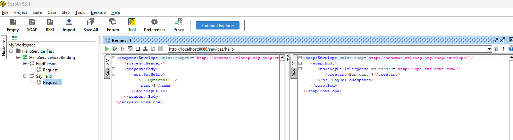

# Service SOAP avec Apache CXF, JAX-WS, JAXB, WSDL et WS-Security

Ce projet est une implémentation d'un service web SOAP sécurisé utilisant la stack technique suivante :
- Apache CXF
- JAX-WS
- JAXB
- WSDL
- WS-Security

## Prérequis

- Java 8 ou supérieur
- Maven 3.6 ou supérieur

## Structure du projet

```
src/
├── main/
│   ├── java/com/acme/cxf/
│   │   ├── api/         # Interfaces de service
│   │   ├── impl/        # Implémentations des services
│   │   ├── client/      # Code client
│   │   └── Server.java  # Point d'entrée du serveur
│   └── resources/       # Fichiers de configuration
└── test/                # Tests unitaires et d'intégration
```

## Installation

1. Cloner le dépôt :
```bash
git clone https://github.com/oui-12/Tp12.git
cd Tp12
```

2. Compiler le projet :
```bash
mvn clean install
```

## Utilisation

### Démarrer le serveur
```bash
mvn exec:java -Dexec.mainClass="com.acme.cxf.Server"
```

### Exécuter les tests
```bash
mvn test
```

### Générer les classes à partir du WSDL
```bash
mvn generate-sources
```

## Configuration WS-Security

Le projet est configuré pour utiliser WS-Security avec les paramètres suivants :
- Authentification par nom d'utilisateur/mot de passe
- Chiffrement des messages
- Signature des messages

## Structure WSDL - Tableau Récapitulatif

| Section WSDL | Balises Clés | Rôle et Fonction |
|--------------|--------------|------------------|
| `<types>` | `<xs:schema>`, `<xs:complexType name="person">` | Définit le dictionnaire de données (XSD). C'est ici que sont structurés les objets échangés (ex. : l'objet person avec age, id, name). |
| `<message>` | `<wsdl:part element="...">` | Définit les enveloppes logiques pour les données. Il fait le lien entre les opérations et les types XSD (ex. : le message FindPerson contient l'élément XSD FindPerson). |
| `<portType>` | `<wsdl:operation>`, `<wsdl:input>`, `<wsdl:output>` | Représente l'interface métier abstraite. Il définit les opérations du service (méthodes) sans référence à un protocole (ex. : les opérations FindPerson et SayHello). |
| `<binding>` | `<soap:binding>`, `<soap:operation>` | Décrit le protocole concret. Il mappe le portType au protocole SOAP sur HTTP et spécifie l'encodage (style="document"). |
| `<service>` | `<wsdl:port>`, `<soap:address location="...">` | Fournit le point d'accès physique (Endpoint). Il indique l'URL réelle où le service est déployé et accessible (ex. : http://localhost:8080/services/hello). |


## SoapUI pour importer l’URL du WSDL
<table align="center">
  <tr>
    <td align="center" style="border: 2px solid #007acc; padding: 10px; border-radius: 8px;">
      
      <br/>
      <em> SoapUI pour importer l’URL du WSDL</em>
    </td>
  </tr>
</table>

## Développement

### Génération des Stubs Client avec wsdl2java (CXF)
<table align="center">
  <tr>
    <td align="center" style="border: 2px solid #007acc; padding: 10px; border-radius: 8px;">
      
      <br/>
      <em>Génération des Stubs Client avec wsdl2java (CXF)</em>
    </td>
  </tr>
</table>

## Documentation

- [Apache CXF Documentation](https://cxf.apache.org/docs/)
- [JAX-WS Documentation](https://javaee.github.io/metro-jax-ws/)
- [JAXB Documentation](https://javaee.github.io/jaxb-v2/)

## Auteur

[Votre nom]

## Licence

[Spécifiez la licence si nécessaire]
